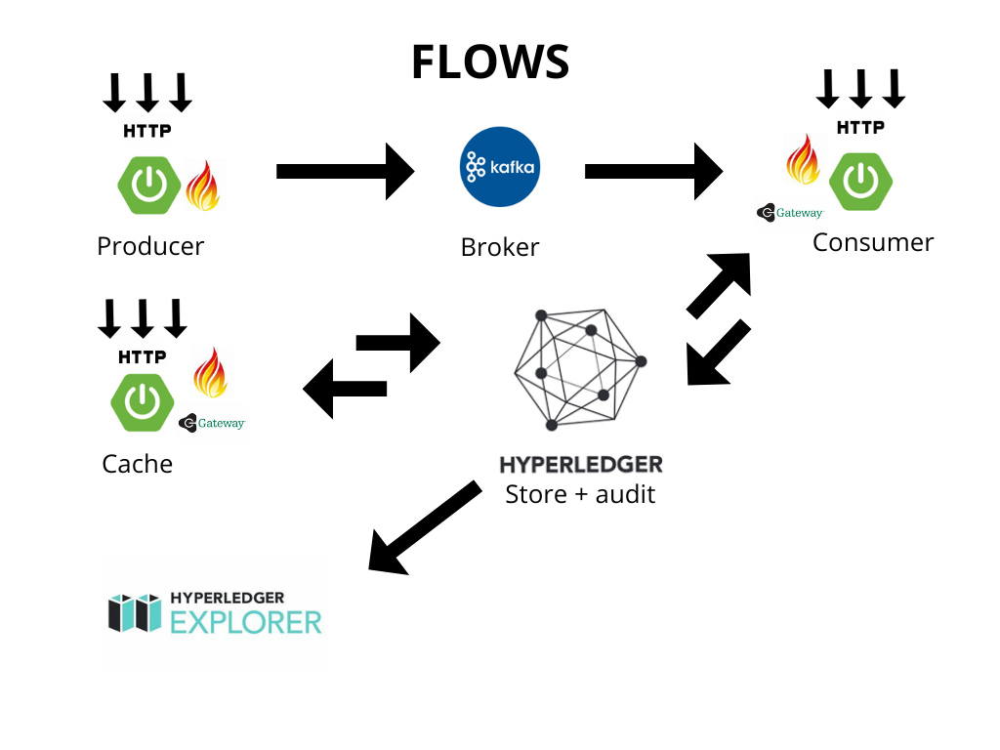
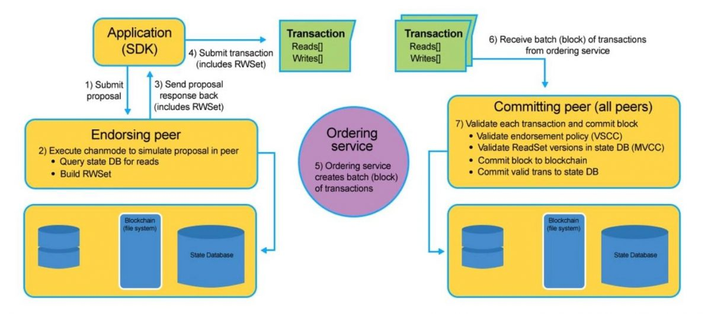
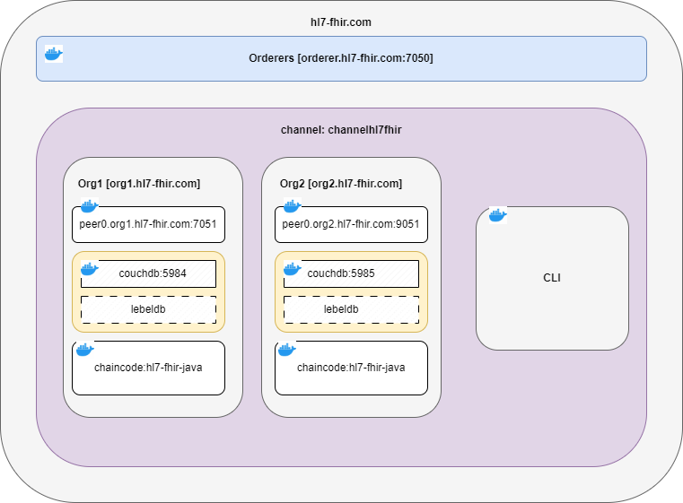

# Decentralized Healthcare Interoperability with Hyperledger, Kafka, and Spring Boot

This project demonstrates the integration of **HL7 FHIR** technology with a private Blockchain network, simulating interactions between a laboratory and two organizations, each managing a hospital. The system is designed to be easily scalable to include additional hospitals or organizations. HL7's international standard, version 4, is used for creating **HL7 FHIR** objects.

The project showcases various integration possibilities offered by these technologies through different data flows.

The goal is to demonstrate secure and decentralized operations within a private Blockchain network, highlighting the advantages of Blockchain in terms of data security and auditability compared to conventional databases.

The core component is the Hyperledger private network, used for storing and persisting data. Two clients connect to this network, _each configured for a distinct organization_. The connection is established using the Hyperledger SDK's Gateway library, which simplifies client-blockchain interactions. Direct interaction with the network is also possible.

Communication between the laboratory's API (Producer) and the Hyperledger network is facilitated through a Kafka broker. For simplification, the system registers basic patient information in **HL7 FHIR** format, rather than complete laboratory analyses.

Spring Boot, along with the HAPI library (which provides comprehensive resources for working with various **HL7 FHIR** versions), is used to develop the clients and the laboratory API.

Hyperledger Explorer, a web-based Blockchain explorer, is used for visualizing and monitoring Hyperledger Fabric networks. It provides an intuitive dashboard for viewing network activity, transactions, blocks, and smart contract execution, aiding in debugging, monitoring, and auditing.

## Flows



### Flow 1: Event-Driven HL7 FHIR Patient Creation and Blockchain Storage

This flow centers on the creation of **HL7 FHIR** Patient records, initiated via a cron job or REST request. Upon successful creation and validation, patient data is published to a Kafka broker. Consumers then ingest this data into the Hyperledger Fabric network.

Crucially, the successful Blockchain commit triggers an event. Subscribers, listening for these events, populate their local caches with the newly created patient data. This event-driven approach ensures efficient data distribution and reduces reliance on direct Blockchain queries for subsequent operations.

### Flow 2: Blockchain State Changes via REST and Event Propagation

This flow illustrates how **HL7 FHIR** Patient records are modified (updated or deleted) in the Blockchain network through REST API requests. The API response includes the operation's result, and crucially, an event is generated. This event's structure and propagation mechanism are consistent with Flow 1, ensuring uniform event handling across data modification scenarios.

### Flow 3: Ensuring Local Cache and Blockchain Data Consistency

This flow outlines how clients using local caches to store **HL7 FHIR** Patient records can directly modify the Blockchain. After a successful update or delete operation, the client's cache is immediately synchronized with the Blockchain's state. In this specific flow, Blockchain-generated events related to these modifications are discarded to maintain data consistency and prevent unnecessary cache updates.

## Hyperledger Internal Flow



## Hyperledger Network Structure



## Technologies Used

* Microservices (Spring Boot, Hyperledger SDK Gateway, Maven, HAPI FHIR)
* Docker and Docker Compose
* Kafka Broker
* Chaincode (Java, Gradle)
* Hyperledger Fabric
    
* Hyperledger Explorer (Optional)

## Prerequisites

To successfully deploy and run this Hyperledger Fabric network with Java chaincode, the following software and dependencies are required:

1. **Windows, you need to install an ubuntu machine and WSL2**
    * Open Command Prompt (or PowerShell) as admin.
    * Install all the WSL2 components and the Ubuntu Linux distro.
    ```bash
    wsl --install
    ```
    * Verify that windows subsitem is enabled with turn windows features on or off and check "Windows Subsystem for Linux" and "Virtual Machine Platform"
    * Download linux kernel update package [download](https://wslstorestorage.blob.core.windows.net/wslblob/wsl_update_x64.msi).
    * Test version _wsl_
    ```bash
    wsl --set-default-version 2
    ```
    * Install "ubuntu" app from windows store [download](https://apps.microsoft.com/search?query=ubuntu&hl=en-us&gl=US&department=Apps).
    * Optional Install "windows terminal" [download](https://apps.microsoft.com/search?query=windows+terminal&hl=en-us&gl=US).
    * Install docker desktop [download]("https://desktop.docker.com/win/stable/amd64/Docker%20Desktop%20Installer.exe") in configuration appear check Install required Windows Components for WSL2.
    * Test Docker
    ```bash
    docker -version
    ```
    * Test Docker-compose
    ```bash
    docker-compose --version
    ```
    * Enable docker for ubuntu in _settings->resources->WSL integration->Enable Ubuntu-xxx_.
    * _restart_.
    * Open Command Prompt (or PowerShell), open Ubuntu and install curl.
    ```bash
    sudo apt update && sudo apt upgrade -y
    install curl
    curl -v
    ```

2. **Ubuntu**
    * Install curl
    ```bash
    sudo apt update && sudo apt upgrade -y
    install curl
    curl -v
    ```
    * Install Docker
    ```bash
    sudo apt remove docker docker-engine docker.io containerd runc
    curl -fsSL https://get.docker.com -o get-docker.sh
    sudo sh get-docker.sh
    docker --version
    ```
    * Install Docker-compose
    ```bash
    sudo usermod -aG docker $USER
    sudo curl -L "https://github.com/docker/compose/releases/download/v2.17.2/ker-compose-$(uname -s)-$(uname -m)" -o /usr/local/bin/docker-compose
    sudo chmod +x /usr/local/bin/docker-compose
    docker-compose version    
    ```
    * Install go
    ```bash
    sudo wget https://golang.org/dl/go1.16.3.linux-amd64.tar.gz
    tar xvf go1.16.3.linux-amd64.tar.gz
    export GOPATH=$HOME/go
    export PATH = $PATH:$GOPATH/bin
    go version
    ```
    * Install java
    ```bash
    sudo apt install software-properties-common
    sudo add-apt-repository ppa:linuxuprising/java
    sudo apt update
    sudo apt install oracle-java21-installer
    java -version
    ```
    * Install graddle or maven (optional) in this case you need to install both because the chaincode uses gradle and the microservices maven
    ```bash
    #gradle
    sudo apt install gradle -y
    gradle --version
    ```
    ```bash
    #maven
    sudo apt install maven -y
    mvn --version
    ```

## Project Respository

[hyperledger-kafka-FhirHl7](https://github.com/santsa/hyperledger-kafka-FhirHl7)
```bash
git clone https://github.com/santsa/hyperledger-kafka-FhirHl7.git
```
_**RUN, the script for launch the net, there are a several options for launch, but the most convenient are the two first, couchdb use more resources wich lebeldb**_
```bash
chmod 755 -R hyperledger-kafka-FhirHl7/*
cd hyperledger-kafka-FhirHl7
```
_**This option up all pipeline with couchdb except the explorer, you have two options with couchdb or lebeldb**_
_***with couchdb***_
```bash
sudo -u user ./scripts/00-start.sh all couchdb
```
_***with lebeldb***_
```bash
sudo -u user ./scripts/00-start.sh all lebeldb
```
_**This option launch Hyperledger Explorer (optional)**_
```bash
sudo -u user ./scripts/00-start.sh explorer
```
### The next options are partial

_**This option up the net without the chaincode**_
_***with couchdb***_
```bash
sudo -u user ./scripts/00-start.sh net couchdb
```
_***with lebeldb***_
```bash
sudo -u user ./scripts/00-start.sh net lebeldb
```
_**Important, It must be start the net before**_
_**This option install chaincode into peers**_
```bash
sudo -u user ./scripts/00-start.sh chaincode
```
**This option run the clients**
_**start client with docker**_
```bash
sudo -u user ./scripts/00-start.sh client
```
_**Start client with maven**_
```bash
sudo -u user ./scripts/00-start.sh client-maven
```
**This option up the net and install chaincode**
_***with couchdb***_
```bash
sudo -u user ./scripts/00-start.sh net-chaincode couchdb
```
_***with lebeldb***_
```bash
sudo -u user ./scripts/00-start.sh net-chaincode lebeldb
```
**This install chaincode and run the clients**_**start client with docker**_
```bash
sudo -u user ./scripts/00-start.sh chaincode-client
```
_**Start client with maven**_
```bash
sudo -u user ./scripts/00-start.sh chaincode-client-maven
```
### For debug option

_**with couchdb**_
```bash
sudo -u user ./scripts/00-start.sh net-chaincode-kafka couchdb
```
_**with lebeldb**_
```bash
sudo -u user ./scripts/00-start.sh net-chaincode-kafka lebeldb
```
_new start providers with dev profile, consumer with devOrg1 and cache with devOrg2_

**_IMPORTANT for correct launch the consumer and cache must run with different organizations._**

### CALLS
Install postman optional [download](https://www.postman.com/downloads/)

**Inside folder postman there are the collections for every Api Call**
* postman/Provider-hl7-fhir.postman_collection.json POST (Producer)
* postman/Consumer-hl7-fhir.postman_collection.json GET, PUT, POST and DELETE (Consumer)
* postman/Hapi FHIR.postman_collection.json GET, VREAD historic, PUT, POST and DELETE (Cache)
_you must change the id for search and update_

### Test complete flow
```bash
docker logs -f fhir-hl7-hapi-cache
```
launch with postman or wait the provider cron every 250 seconds
localhost:8083/FHIRHl7KafkaProvider/baseR4/fhir/Patient/send-messages-fhir/5
-->Gateway event launch CreateAsset - Org1MSP!
```bash
docker logs -f fhir-hl7-consumer
```
Received message: {
  "resourceType": "Patient",
  "id": "788614be-2b02-46a1-86e2-a0b099903bde",
  "meta": {
    "versionId": "1"
  },
  "identifier": [ {
    "system": "http://acme.org/MRNs",
    "value": "0a2553c2-4910-4f6f-9594-ac758eb64c2b"
  } ],
  "name": [ {
    "family": "Simpson",
    "given": [ "Homer", "J" ]
  } ],
  "telecom": [ {
    "system": "phone",
    "value": "1 (416) 340-4800",
    "use": "home"
  } ],
  "gender": "other",
  "address": [ {
    "city": "boston",
    "postalCode": "12345"
  } ]
}
2025-03-24T11:29:19.498Z  INFO 1 --- [ntainer#0-0-C-1] c.k.c.extensions.FhirMessageProcessor    : 
--> Init validate Resource
2025-03-24T11:29:19.613Z  INFO 1 --- [ntainer#0-0-C-1] c.k.c.extensions.FhirMessageProcessor    : Validation successful. No issues found.
2025-03-24T11:29:19.614Z  INFO 1 --- [ntainer#0-0-C-1] c.kafka.consumer.service.PatientService  : 
--> Evaluate Transaction: ReadAsset, function returns asset attributes
2025-03-24T11:29:19.639Z  INFO 1 --- [ntainer#0-0-C-1] c.kafka.consumer.service.PatientService  : 
--> Submit Transaction: createPatient, creates new patient with arguments

_**Acces couchdb**_

<http://localhost:5984/_utils/#login>

_admin : adminpw_

_inside database_

<http://localhost:5984/_utils/#database/channelhl7fhir_hl7-fhir-java/_all_docs>

_**Acces explorer for monitoring**_

<http://localhost:8085/#/login>

_exploreradmin : exploreradminpw_

_jdbc:postgresql://localhost:5432/postgres_

_hppoc : password_